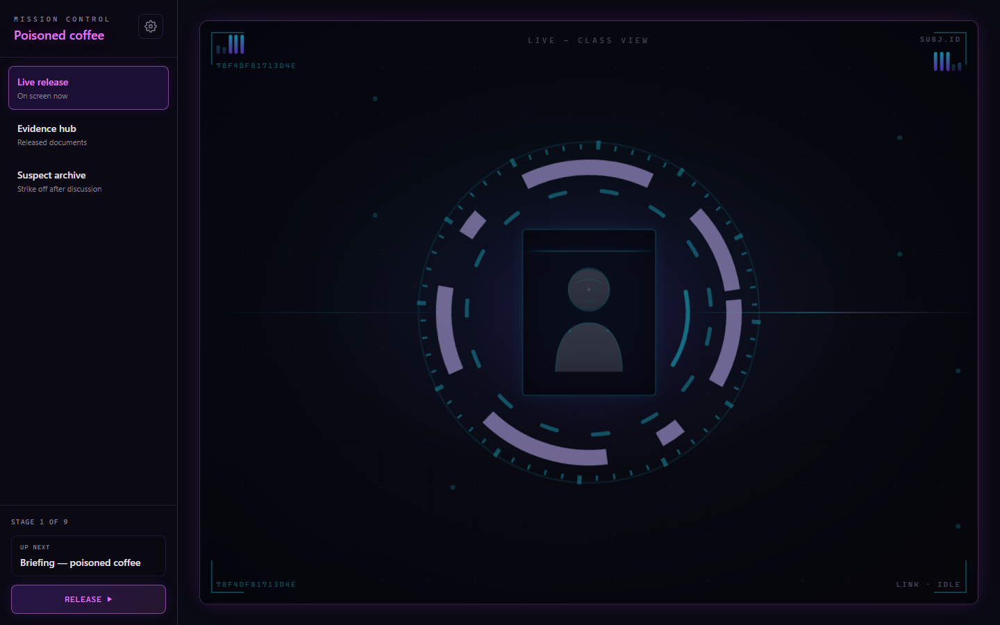

# Poisoned Coffee — Forensics Computing

An interactive classroom murder-mystery lesson for **Year 5/6**. Pupils work in pairs with paper suspect files, maths and English tasks, and a teacher-controlled mission board. The digital layer adds cinematic evidence releases, a fictional **Ultra AI** forensic stack, scripted suspect interviews with voice, and printable worksheets.

**Guilty party:** Mr Grant (PE teacher). **Setting:** St Oakwood Primary, Monday 17 March 2026.

---

## Quick start

```bash
npm install
npm run dev          # http://localhost:5173 (use a free port if 5173 is taken)
npm run build
npm run preview      # production preview
npm test             # Playwright e2e
```

No environment variables are required at runtime. Interview voice uses bundled MP3s in `public/audio/interviews/`.

---

## URLs

| URL | Who | Purpose |
|-----|-----|---------|
| `/` | Teacher (IWB) | Mission control — release stages, evidence hub, suspect archive |
| `/code` | Pairs (iPad) | Enter 4-digit codes from paper tasks (theatre only) |
| `/interview?live=1&p=grant,patel` | Pairs (iPad) | Secure interview chat after teacher starts |
| `/print/all` | Teacher | Full six-handout print bundle |
| `/print/suspects` | Teacher | Suspect bio sheet (15 cards) |
| `/print/forensics` | Teacher | Fingerprint and tread reference cards |
| `/print/task/spag` | Teacher | Task 1 — SPAG → code **5374** |
| `/print/task/maths` | Teacher | Task 2 — algebra → code **7859** |
| `/print/task/victim` | Teacher | Task 3 — victim profile → code **1991** |
| `/print/jury` | Teacher | Jury declaration (debrief hand-in) |

Print routes open from the gear icon on the control board sidebar.

---

## Lesson flow (teacher)

1. **Print** handouts 1–6 in order (`/print/all` or individual routes).
2. Open **`/`** on the classroom display. Tap **Release ▶** for each stage as the morning progresses.
3. At each code milestone, pairs solve the paper task and enter the code on **`/code`** (optional theatre — codes do not unlock the board).
4. Hand out physical evidence envelopes when the board releases sign-in, fingerprint, footprint, and sugar-bowl clues.
5. After the **Ultra AI** stage, class picks two suspects to interview. Tap **Start interviews ▶** and send pairs to the on-screen `/interview` link.
6. **Debrief** — collect jury declarations, reveal Mr Grant on the board.

Full stage list, all copy, suspect data, interview scripts, and technical detail live in **[SOURCE-OF-TRUTH.md](./SOURCE-OF-TRUTH.md)**.

---

## Screenshots

Captured from the production build via `node scripts/capture-screenshots.mjs` (requires preview server on port 4180 or set `PREVIEW_URL`).

| File | View |
|------|------|
| `screenshots/01-control-standby.png` | Pending — forensic HUD standby |
| `screenshots/02-control-briefing.png` | Briefing released |
| `screenshots/03-control-archive.png` | Suspect archive with names struck off |
| `screenshots/04-control-evidence-hub.png` | Evidence hub — released documents |
| `screenshots/05-control-csi-ultra-ai.png` | Ultra AI probabilistic match bars |
| `screenshots/06-control-interview-pick.png` | Interview picker — final five |
| `screenshots/07-interview-grant-gotcha.png` | Grant interview — cupboard slip |
| `screenshots/08-code-entry.png` | Pair iPad access terminal |
| `screenshots/09-control-debrief.png` | Debrief — guilty reveal |
| `screenshots/10-print-suspect-pack.png` | Printable suspect pack cover |



---

## Scripts

| Command | Purpose |
|---------|---------|
| `npm run dev` | Vite dev server |
| `npm run build` | Typecheck + production build |
| `npm run preview` | Serve `dist/` locally |
| `npm test` | Playwright e2e tests |
| `npm run generate-interview-audio` | Regenerate Grant/Patel voice clips via ElevenLabs (needs `.env.local`) |
| `npm run print-pack` | Generate print-pack PDF |
| `node scripts/capture-screenshots.mjs` | Refresh README screenshots |

---

## Optional: regenerate interview voice

Copy `.env.example` to `.env.local` and set `VITE_ELEVENLABS_API_KEY`. Then:

```bash
npm run generate-interview-audio
```

This writes MP3s to `public/audio/interviews/` and updates `manifest.json`. Never commit `.env.local`.

---

## Deploy

Vercel SPA rewrites (`vercel.json`) — all paths serve `index.html`. Build command: `npm run build`, output: `dist/`.

---

## Related docs

- **[SOURCE-OF-TRUTH.md](./SOURCE-OF-TRUTH.md)** — complete product spec: all copy, AI systems, lesson design, routes, data model
- **[GRANT-PATEL-INTERVIEWS.md](./GRANT-PATEL-INTERVIEWS.md)** — interview Q&A reference (Grant & Patel)
- **[INTERVIEW-SCRIPTS.md](./INTERVIEW-SCRIPTS.md)** — original design notes for five final-five interviews (partially implemented)
